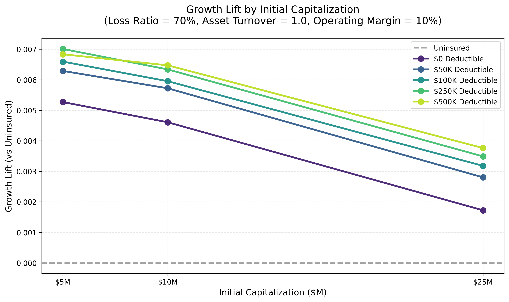

# Ergodicity Advantage Landing Page Approach Document

## Website Audience

The target audience is corporate insurance buyers like CFOs and sophisticated, forward-thinking Risk Managers.

## Where is This Hosted?

The website URL is https://MostlyOptimal.com/

The website code is stored on https://github.com/AlexFiliakov/MostlyOptimal.com

It is built on `Next.js` and `Node.js`

The website is deployed to CloudFlare page hosting (free), where it is compiled and configured for `NODE_VERSION = 20` (this can be changed if you want, or you can tell me an alternative web framework to deploy on CloudFlare that you prefer). I prefer to keep CloudFlare, but otherwise it supports many web technologies, although my other websites are all built with Next.js.

If you stick with Next.js, all you need to do is deploy the code to GitHub and it will show up on the website after a few minutes. Otherwise, you'll need to tell me what web tech you use so I can configure CloudFlare appropriately.

The website must work on mobile, but the current version doesn't fully work on the iPhone, and probably not on Android, either.

## Website Goal

The website has 3 goals:
- Get visitors excited about the open-source financial simulation framework and serve as a white paper advertising its main features
- Drive visitors to the Getting Started page on "https://docs.ergodicityadvantage.com/api/tutorials/01_getting_started.html"
- Link to my research paper which is hosted on "https://drive.google.com/open?id=1_vcIHcM3DHIqRdWqwPg_2pGctAMBpJ01&usp=drive_fs" for now, hopefully to be published elsewhere.

The overarching goal is to distribute my open-source software, create thought leadership, expand my network, and push the industry into higher levels of sophistication.

## Communication Approach

1. The website should feel bright, airy, and energizing, so I'm avoiding a black backgrounds in favor of mainly light negative space. Style should be clean and conservative.

2. Use existing website's content or ask me for anything additional.

3. For my target audience of CFOs and Risk Managers, I'd like a more approachable, innovative, down-to-earth-yet-forward-thinking tone that makes my project less intimidating. The ideal path for a visitor is someone like a CFO / Risk Manager who gets excited and hands this off to their more technical staff to investigate further. I'm more trying to get them interested rather than position myself as an authority, so prioritizing an approachable tone is more important. The research paper is more authoritative, so that part gets taken care of and doesn't need to be on the website necessarily. I expect that I'll provide the copy for the website, so feel free to ask me for copy input, and you provide the design. You can start with the existing site, which I like already (https://MostlyOptimal.com), but I feel it can be taken to another level.

## Content

### Highlight some research findings from my paper to illustrate what the framework does

This graphic can go on the website:

(Without getting into specific numbers because those depend heavily on the assumptions used, so very company-specific):
- It can be shown under reasonable assumptions that insurance enhances growth over time compared to self-insurance
  - Optimal insurance strategy depends highly on the specific financial profile of the business
  - Insurance can be highly beneficial at lower capitalizations
  - High deductibles are often optimal to provide protection against capital erosion from large and catastrophic losses
  - At low capitalization levels, lower deductibles become optimal
  - It is generally optimal to retain some level of risk instead of paying to insure against attritional losses
  - We encourage you to input your own business assumptions and evaluate your current insurance program

### Project Highlights

- Peruse the existing landing page to get a sense of the product features, which we can include here: https://MostlyOptimal.com

### Link to Getting Started guide

https://docs.ergodicityadvantage.com/api/tutorials/01_getting_started.html

### Link to Ongoing Research

https://drive.google.com/open?id=1_vcIHcM3DHIqRdWqwPg_2pGctAMBpJ01&usp=drive_fs

### About Me

With over 11 years of actuarial experience spanning Annuities, Life Insurance, P&C Personal Lines, and Commercial Casualty across both carrier and broker roles, I've developed a comprehensive understanding of insurance from every angle. This unique vantage point revealed a persistent gap: companies lack sophisticated frameworks to evaluate insurance purchasing decisions with the same rigor that carriers apply to underwriting and pricing.

I designed this open-source framework to help companies optimize their growth through better insurance structures, drawing on analytical methods from actuarial science, data science, and software engineering.

My career began in Life Insurance and Annuities, where I built dynamic capital models to quantify how management decisions impact company financials. At Verisk Analytics, I spent nearly four years modernizing actuarial analytical environments to enable the next generation of analytical products. My Commercial Casualty pricing practice has focused on Workers' Compensation, General Liability, Product Liability, and Commercial Auto Liability, giving me deep technical expertise in the lines that matter most to operating companies.

In my current role at a commercial insurance broker, I optimize insurance programs for dozens of clients with millions of dollars in combined premiums. This work reinforced a key insight: the analytical tools available to insurance buyers lag far behind what carriers use internally for enterprise risk management. This framework bridges that gap, applying carrier-grade analytics to the buyer's decision-making process.

Alex Filiakov, ACAS

### Footer link to Documentation

https://docs.mostlyoptimal.com/api/index.html

## Visual Identity & Color Scheme

### Primary Palette

#### Core Colors
- **Pure White (#FFFFFF)** - Primary background, creating the bright, airy foundation
- **Soft Silver (#AEC6C1)** - Hero sections, subtle backgrounds for content blocks
- **Sage Green (#B4D1B8)** - Primary accent for CTAs, highlighting growth and innovation
- **Cool Mist (#BDD1CC)** - Secondary backgrounds, card overlays with transparency
- **Warm Gray (#D7DCD7)** - Text backgrounds, subtle dividers, breathing space

#### Supporting Colors
- **Deep Forest (#2A4D3A)** - Headlines, primary text for authority and readability
- **Electric Teal (#00B4A6)** - Interactive elements, hover states, innovation accent
- **Lightning Blue (#4A90E2)** - Data visualization, technical diagrams, "illumination" moments
- **Warm Gold (#F7C948)** - Success indicators, premium features, subtle highlights

### Color Application Strategy

**Hero Section:**
- Background: Gradient from Pure White to Soft Silver (#AEC6C1)
- Headlines: Deep Forest (#2A4D3A)
- Call-To-Action Buttons: Sage Green (#B4D1B8) with white text
- Accent graphics: Lightning Blue overlays at 20% opacity

**Content Blocks:**
- Alternating white and Cool Mist (#BDD1CC) sections
- Card overlays: Warm Gray (#D7DCD7) at 40% opacity over photography
- Interactive elements: Electric Teal (#00B4A6) on hover

**Navigation:**
- Background: Pure White with subtle shadow
- Links: Deep Forest, transitioning to Electric Teal on hover
- Active states: Sage Green underline

### Parallax Photography Layer Recommendations
- **Background Layer:** Soft, abstract patterns (tree branches, circuit patterns)
- **Middle Layer:** Key photography with subtle Ken Burns (zoom) effect
- **Foreground Layer:** Floating data visualization elements, subtle particles

## Imagery

I have an Unsplash+ account for high-quality and high-resolution stock photos, so ask me for the types of images you want, or use the existing ones on the website and I can always adjust later.

## When is this needed?

No rush, hopefully end of October, but sooner the better. Once you have something, I can give you a testimonial and we can iterate from there. But I can also iterate on my own if you give me an improvement over my current website.
